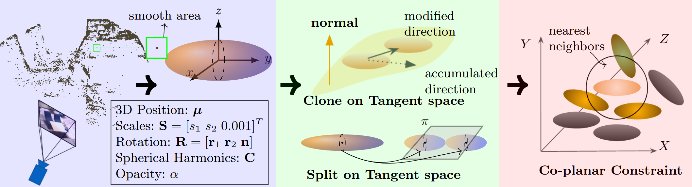
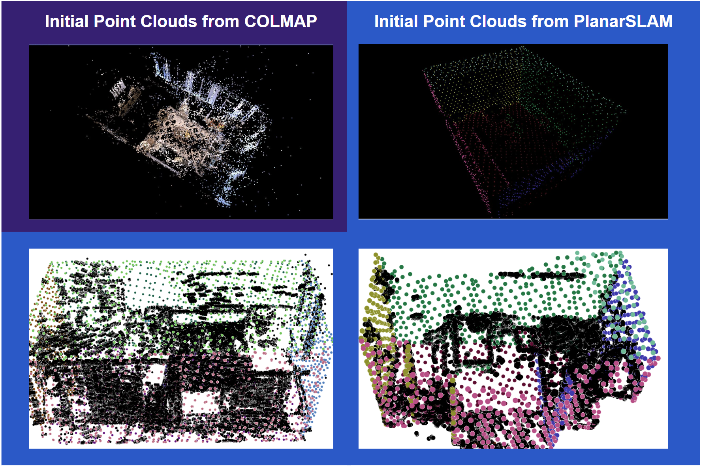

# GeoGaussian: Geometry-aware Gaussian Splatting for Scene Rendering (ECCV 2024)

<p align="center" width="100%">
    
</p>

--------
<p align="center">
	<a href="https://yanyan-li.github.io/project/gs/geogaussian.html"></a>
     <a href="http://arxiv.org/abs/2403.11324"></a>
    <a href="https://"></a>
</p>


## 📖 Abstract
During the Gaussian Splatting optimization process, the scene
geometry can gradually deteriorate if its structure is not deliberately 
preserved, especially in non-textured regions such as walls, ceilings, 
and furniture surfaces. This degradation significantly affects 
the rendering quality of novel views that deviate significantly 
from the viewpoints in the training data. 
To mitigate this issue, we propose a novel approach called ***GeoGaussian***. 
Based on the smoothly connected areas observed from point clouds, 
this method introduces a novel pipeline to initialize thin Gaussians 
aligned with the surfaces, where the characteristic can be transferred 
to new generations through a carefully designed densification strategy. 
Finally, the pipeline ensures that the scene
geometry and texture are maintained through constrained optimization 
processes with explicit geometry constraints. Benefiting from 
the proposed architecture, the generative ability of 3D Gaussians 
is enhanced, especially in structured regions.
Our proposed pipeline achieves state-of-the-art performance 
in novel view synthesis and geometric reconstruction, 
as evaluated qualitatively and quantitatively on public datasets.

<div align="center">


</div>

<div align="center">
<b>  3DGS | LightGS | GeoGaussian(Ours) </b> 
</div>
 

*Comparisons of novel view rendering on public datasets. At some challenging
viewpoints having bigger differences in translation and orientation motions compared
with training views, 3DGS and LightGS have issues with photorealistic rendering.*

## 📋 TODO Lists
- [x] *Repo* - Create repo for [GeoGaussian](https://github.com/yanyan-li/GeoGaussian).
- [x] *Code* - Release for our methods.
- [x] *Code* - Randomly sample N points for each Gaussian point [script](sample_gaussian_model.py).
- [x] *Dataset* - Upload [dataset](#-dataset) download link.
- [x] *ReadMe* - Teaser( [I](img/gif/compressed-o2-out.gif) [II](img/gif/compressed-o2-out.gif) [III](img/gif/compressed-icl-r2-out.gif) ) images & [Abstract](#-abstract).
- [x] *ReadMe* - Geometry-aware [Strategies](#-geometry-aware-strategies).
- [x] *ReadMe* - Repository [Setup](#-setup-of-geogaussian).
- [x] *ReadMe* - [Results](#-results) for Table I. & Table II.
- [x] *ReadMe* - [License](#-license) & [Acknowledgment](#-acknowledgment) & [Citation](#-citation).
- [x] *License* - Released under the [Gaussian-Splatting License](LICENSE.md).
- [x] *Test* - Tested on Windows Workstation
- [x] *Test* - Tested on Ubuntu Server

## 🚀 Geometry-aware Strategies
<div align="center">

</div>

- A parameterization with explicit geometry meaning for thin 3D Gaussians is employed in our carefully designed initialization and densification strategies} to establish reasonable 3D Gaussian models.
- A geometrically consistent constraint is proposed to encourage thin Gaussians to align with the smooth surfaces.


## 💾 Dataset
Based on the SLAM method, **PlanarSLAM**, we create new point clouds rather then using results of COLMAP for experiments. 

<p align="center" width="100%">
    
</p>

**New Features of this type of input:**
<ol>
<li> Points lying on the non-textured regions </li>
<li> Global plane instances that are represented in different colors </li>
<li> Surface normal vector of each planar point </li>
</ol>

The subdataset can be obtained via 
[Replica (PlanarSLAM)](https://drive.google.com/drive/folders/1LO0a-M__cZJu3TnaMX-fEP4YxFs5LDGZ?usp=drive_link), 
[TUM RGB-D (PlanarSLAM)](https://drive.google.com/drive/folders/1hDPRH3FGg_HpQYwZWg_wgZbonClVbcbC?usp=drive_link), 
[ICL NUIM (PlanarSLAM)](https://drive.google.com/drive/folders/1UV7DqybCUcYl3Yn4kV030lQOKhwGUHU6?usp=drive_link). 
Then you need to place the raw dataset images in the ``results`` folder. 
The raw images can be obtained via 
[Replica](https://cvg-data.inf.ethz.ch/nice-slam/data/Replica.zip), 
[TUM RGB-D](https://cvg.cit.tum.de/data/datasets/rgbd-dataset/download), 
[ICL NUIM](https://www.doc.ic.ac.uk/~ahanda/VaFRIC/iclnuim.html).

For each sequence, the structure is organized as follows
```
Replica_r2
	|______PointClouds.ply          # sparse point clouds from the SLAM system
 	|______KeyFrameTrajectory2.txt  # camera poses from the SLAM system
  	|______results                  # folder for all raw images
```
*our code provides the interface to deal with the type of data format.*


## 🎓 Baseline
**1. Gaussian-Splatting with Planar Point Clouds**
[Repo](https://github.com/yanyan-li/gaussian-splatting-using-PlanarSLAM?tab=readme-ov-file)


## 🔧 Setup of GeoGaussian
### 1. Clone the repo.
```
# https
git clone https://github.com/yanyan-li/GeoGaussian
# or ssh
git clone git@github.com:yanyan-li/GeoGaussian.git
```

### 2. Environment setup.
If you have an environment used for 3dgs, use it. 
If not, please refer to the environment configuration of [3DGS environment](https://github.com/graphdeco-inria/gaussian-splatting?tab=readme-ov-file#local-setup) 
The ``environment.yml`` file for 3DGS has been provided in our repo.

Additionally, you also need to install the 
``open3d`` ``scipy`` ``matplotlib`` ``pillow``
libraries.

```
# If you have already installed the 3dgs environment,
# please activate the environment and execute the following command :
conda activate gaussian_splatting
pip install open3d scipy matplotlib pillow
```

### 3. Download the demo dataset
- Create a new ``data`` folder
- Download the file ([Replica OFF2](https://drive.google.com/file/d/1F24k1tGOXqaEgzR3H4Wh3hcqcNzLph9Q/view?usp=drive_link)).
- Unzip it to ``data`` folder.

### 4. Run the codes 
In order to run our code, 
you should specify the path of the dataset 
which should include the ``KeyFrameTrajectory.txt`` file or ``sparse`` folder 
and specify the sparsity of the images that is the interval between the input images.
```
# python train.py -s [path_to_dataset] --sparse_num [N]( 1 ==> 100% images, 5 ==> 20% images)
```
Run demo:
```
python train.py -s data/Replica-OFF2 --sparse_num 1
```
Then you will find that the ``output`` folder has a specific ``xxxxxxxx-x`` directory, 
as well as ``depth`` and ``rgb`` directories, 
which respectively store the RGB and depth images 
rendered during the training process.


## 📊 Results

<table>
    <tr>
        <td colspan="2"><div align="center">Methods<br>Data</div></td> 
        <td colspan="4"><div align="center">3DGS</div></td> 
        <td colspan="4"><div align="center">LightGS</div></td> 
        <td colspan="4"><div align="center">GeoGaussian(Ours)</div></td>
    </tr>
    <tr>
        <td rowspan="3"><div align="left">R1</div></td>    
        <td rowspan="3"><div align="center">PSNR↑<br>SSIM↑<br>LPIPS↓</div></td>
        <td>30.49</td> 
        <td>33.98</td>
        <td>37.45</td>
        <td>37.60</td>
        <td><i>30.54</i></td>
        <td><i>34.06</i></td>
        <td><i>37.72</i></td>
        <td><i><b>38.44</b></i></td>
        <td><i><b>31.65</b></i></td>
        <td><i><b>35.17</b></i></td>
        <td><i><b>38.00</b></i></td>
        <td><i>38.24</i></td>
    </tr>
    <tr>
        <td><i>0.932</i></td>
        <td><i>0.951</i></td>
        <td>0.964</td>
        <td>0.965</td>
        <td><i>0.932</i></td>
        <td><i>0.951</i></td>
        <td><i>0.965</i></td>
        <td><i>0.967</i></td>
        <td><i><b>0.937</b></i></td>
        <td><i><b>0.957</b></i></td>
        <td><i><b>0.968</b></i></td>
        <td><i><b>0.979</b></i></td>
    </tr>
    <tr>
        <td><i>0.051</i></td>
        <td>0.036</td>
        <td>0.029</td>
        <td>0.028</td>
        <td><i>0.051</i></td>
        <td><i>0.035</i></td>
        <td><i>0.028</i></td>
        <td><i>0.025</i></td>
        <td><i><b>0.041</b></i></td>
        <td><i><b>0.027</b></i></td>
        <td><i><b>0.022</b></i></td>
        <td><i><b>0.021</b></i></td>
    </tr>
    <tr>
        <td rowspan="3"><div align="left">R2</div></td>    
        <td rowspan="3"><div align="center">PSNR↑<br>SSIM↑<br>LPIPS↓</div></td>
        <td>31.53</td>
        <td>35.82</td>
        <td>38.53</td>
        <td>38.70</td>
        <td><i>31.54</i></td>
        <td><i>35.93</i></td>
        <td><i>38.78</i></td>
        <td><i>39.07</i></td>
        <td><i><b>32.13</b></i></td>
        <td><i><b>36.81</b></i></td>
        <td><i><b>38.84</b></i></td>
        <td><i><b>39.14</b></i></td>
    </tr>
    <tr>
        <td><i>0.935</i></td> 
        <td><i>0.959</i></td> 
        <td><i>0.968</i></td> 
        <td><i>0.968</i></td> 
        <td><i>0.935</i></td> 
        <td><i>0.959</i></td> 
        <td><i>0.968</i></td> 
        <td><i>0.968</i></td> 
        <td><i><b>0.943</b></i></td> 
        <td><i><b>0.963</b></i></td> 
        <td><i><b>0.969</b></i></td> 
        <td><i><b>0.970</b></i></td> 
    </tr>
    <tr>
        <td>0.050</td> 
        <td><i>0.031</i></td> 
        <td>0.028</td> 
        <td>0.029</td> 
        <td><i>0.049</i></td> 
        <td><i>0.031</i></td> 
        <td><i>0.027</i></td> 
        <td><i>0.028</i></td> 
        <td><i><b>0.041</b></i></td> 
        <td><i><b>0.025</b></i></td> 
        <td><i><b>0.024</b></i></td> 
        <td><i><b>0.024</b></i></td>
    </tr>
    <tr>
        <td rowspan="3"><div align="left">OFF3</div></td>    
        <td rowspan="3"><div align="center">PSNR↑<br>SSIM↑<br>LPIPS↓</div></td>
        <td>30.90</td> 
        <td>33.86</td> 
        <td>36.26</td> 
        <td>36.56</td> 
        <td><i>30.93</i></td> 
        <td><i>33.90</i></td> 
        <td><i>36.38</i></td> 
        <td><i>36.63</i></td> 
        <td><i><b>31.62</b></i></td> 
        <td><i><b>33.91</b></i></td> 
        <td><i><b>36.42</b></i></td> 
        <td><i><b>36.66</b></i></td>
    </tr>
    <tr>
        <td><i>0.928</i></td> 
        <td>0.946</td> 
        <td><i>0.958</i></td> 
        <td><i>0.959</i></td> 
        <td><i>0.928</i></td> 
        <td><i>0.947</i></td> 
        <td><i>0.958</i></td> 
        <td>0.958</td> 
        <td><i><b>0.938</b></i></td> 
        <td><i><b>0.953</b></i></td> 
        <td><i><b>0.963</b></i></td> 
        <td><i><b>0.964</b></i></td>
    </tr>
    <tr>
        <td><i>0.052</i></td> 
        <td><i>0.040</i></td> 
        <td>0.037</td> 
        <td>0.036</td> 
        <td><i>0.052</i></td> 
        <td><i>0.040</i></td> 
        <td><i>0.036</i></td> 
        <td><i>0.037</i></td> 
        <td><i><b>0.040</b></i></td> 
        <td><i><b>0.032</b></i></td> 
        <td><i><b>0.029</b></i></td> 
        <td><i><b>0.029</b></i></td>
    </tr>
    <tr>
        <td rowspan="3"><div align="left">OFF4</div></td>    
        <td rowspan="3"><div align="center">PSNR↑<br>SSIM↑<br>LPIPS↓</div></td>
        <td><i>29.5</i></td> 
        <td>32.98</td> 
        <td>37.70</td> 
        <td>38.48</td> 
        <td>29.51</td> 
        <td><i>32.97</i></td> 
        <td><i>37.95</i></td> 
        <td><i>38.59</i></td> 
        <td><i><b>31.90</b></i></td> 
        <td><i><b>34.61</b></i></td> 
        <td><i><b>38.30</b></i></td> 
        <td><i><b>38.74</b></i></td>
    </tr>
    <tr>
        <td>0.920</td> 
        <td><i>0.941</i></td> 
        <td><i>0.962</i></td> 
        <td><i>0.964</i></td> 
        <td>0.920</td> 
        <td><i>0.941</i></td> 
        <td><i>0.962</i></td> 
        <td><i>0.964</i></td> 
        <td><i><b>0.936</b></i></td> 
        <td><i><b>0.953</b></i></td> 
        <td><i><b>0.966</b></i></td> 
        <td><i><b>0.967</b></i></td>
    </tr>
    <tr>
        <td><i>0.070</i></td> 
        <td><i>0.049</i></td> 
        <td>0.037</td> 
        <td><i>0.035</i></td> 
        <td><i>0.070</i></td> 
        <td><i>0.049</i></td> 
        <td><i>0.036</i></td> 
        <td>0.036</td> 
        <td><i><b>0.050</b></i></td> 
        <td><i><b>0.036</b></i></td> 
        <td><i><b>0.030</b></i></td> 
        <td><i><b>0.031</b></i></td>
    </tr>
    <tr>
        <td rowspan="3"><div align="left">Avg.</div></td>    
        <td rowspan="3"><div align="center">PSNR↑<br>SSIM↑<br>LPIPS↓</div></td>
        <td>30.62</td> 
        <td>34.16</td> 
        <td>37.49</td> 
        <td>37.84</td> 
        <td><i>30.63</i></td> 
        <td><i>34.22</i></td> 
        <td><i>37.71</i></td> 
        <td><i>38.18</i></td> 
        <td><i><b>31.83</b></i></td> 
        <td><i><b>35.13</b></i></td> 
        <td><i><b>38.18</b></i></td> 
        <td><i><b>38.20</b></i></td>
    </tr>
    <tr>
        <td><i>0.929</i></td> 
        <td>0.949</td> 
        <td><i>0.964</i></td> 
        <td><i>0.964</i></td> 
        <td><i>0.929</i></td> 
        <td><i>0.950</i></td> 
        <td><i>0.964</i></td> 
        <td><i>0.964</i></td> 
        <td><i><b>0.939</b></i></td> 
        <td><i><b>0.957</b></i></td> 
        <td><i><b>0.967</b></i></td> 
        <td><i><b>0.970</b></i></td>
    </tr>
    <tr>
        <td><i>0.056</i></td> 
        <td><i>0.039</i></td> 
        <td><i>0.032</i></td> 
        <td><i>0.032</i></td> 
        <td><i>0.056</i></td> 
        <td><i>0.039</i></td> 
        <td><i>0.032</i></td> 
        <td><i>0.032</i></td> 
        <td><i><b>0.043</b></i></td> 
        <td><i><b>0.030</b></i></td> 
        <td><i><b>0.026</b></i></td> 
        <td><i><b>0.026</b></i></td>
    </tr>
</table>

<div>
Table I. Comparison of rendering on the Replica dataset. 
↓ indicates the lower the better, 
↑ indicates the higher the better.
The best score is in <i><b>bold and italic</b></i>. 
The second best score is in <i>italic</i>.
</div>


--------

<table>
    <tr>
        <td colspan="2"><div align="center">methods</div></td> 
        <td>R0</td> 
        <td>R1</td> 
        <td>R2</td> 
        <td>OFF0</td> 
        <td>OFF1</td> 
        <td>OFF2</td> 
        <td>OFF3</td> 
        <td>OFF4</td> 
        <td>Avg.</td> 
    </tr>
    <tr>
        <td rowspan="4"><div align="left">3DGS<br><br>GeoGaussian<br>(Ours)</div></td>    
        <td rowspan="2"><div align="center">mean (m)<br>std (m)</div></td>
        <td>0.026</td> 
        <td>0.025</td>
        <td>0.042</td>
        <td>0.017</td>
        <td><i><b>0.019</b></i></td>
        <td>0.039</td>
        <td>0.032</td>
        <td>0.032</td>
        <td>0.029</td>
    </tr>
    <tr>
        <td>0.066</td>
        <td>0.081</td>
        <td>0.146</td>
        <td>0.050</td>
        <td><i><b>0.055</b></i></td>
        <td><i><b>0.201</b></i></td>
        <td>0.066</td>
        <td>0.112</td>
        <td>0.097</td>
    </tr>
    <tr>
<td rowspan="2"><div align="center">mean (m)<br>std (m)</div></td>
        <td><i><b>0.018</b></i></td>
        <td><i><b>0.014</b></i></td>
        <td><i><b>0.015</b></i></td>
        <td><i><b>0.020</b></i></td>
        <td>0.029</td>
        <td><i><b>0.013</b></i></td>
        <td><i><b>0.018</b></i></td>
        <td><i><b>0.014</b></i></td>
        <td><i><b>0.018</b></i></td>
    </tr>
    <tr>
        <td><i><b>0.032</b></i></td> 
        <td><i><b>0.016</b></i></td> 
        <td><i><b>0.028</b></i></td> 
        <td><i><b>0.042</b></i></td> 
        <td>0.067</td> 
        <td>0.024</td> 
        <td><i><b>0.020</b></i></td> 
        <td><i><b>0.023</b></i></td> 
        <td><i><b>0.031</b></i></td> 
    </tr>
</table>

Table II. Comparison of reconstruction performance on the Replica dataset.
Based on the ground truth mesh models provided by the
Replica dataset, we align these mesh models with point clouds from Gaussian
models, where we randomly sample three points in each Gaussian ellipsoid.

## ⭕️ Acknowledgment
This project is based on [3DGS](https://github.com/graphdeco-inria/gaussian-splatting) 
and relies on data provided by [PlanarSLAM](https://github.com/yanyan-li/PlanarSLAM) work. 
Thanks for the contribution of the open source community.


## 📋 License
This project is released under the [Gaussian-Splatting License](LICENSE.md).


## ✉️ Citation
If you find this project useful in your research, please consider cite:

*BibTex*
```
@article{li2024geogaussian,
  title={GeoGaussian: Geometry-aware Gaussian Splatting for Scene Rendering},
  author={Li, Yanyan and Lyu, Chenyu and Di, Yan and Zhai, Guangyao and Lee, Gim Hee and Tombari, Federico},
  journal={arXiv preprint arXiv:2403.11324},
  year={2024}
}
```
